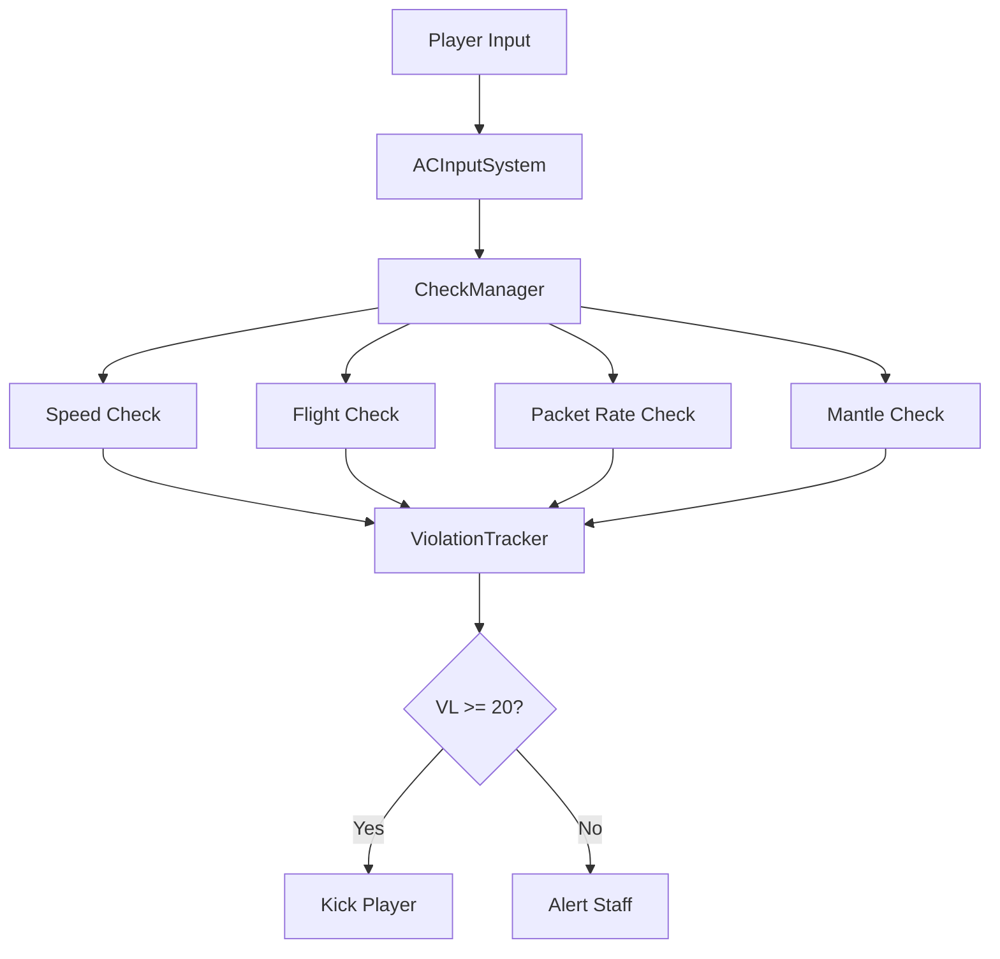

Spectre is a server-side anticheat plugin for Hytale that detects and prevents common exploits like flight, speed hacks, and packet manipulation. Built on Hytale's ECS architecture, Spectre validates player movements in real-time and automatically kicks cheaters when their violation level exceeds the threshold.

## How it works

Spectre integrates directly into Hytale's entity system pipeline using `EntityTickingSystem`. It runs before the server processes player input, validating every movement update against a suite of configurable checks:

- **Flight detection** - Prevents unauthorized flying
- **Speed validation** - Enforces realistic lateral and vertical movement speeds
- **Packet rate limiting** - Blocks input queue flooding attacks
- **Mantle abuse prevention** - Validates climbing mechanics

When a player fails a check, Spectre increments their violation level (VL). If VL exceeds 20.0, the player is automatically kicked. VL decays naturally at 0.05 per tick when players behave normally.

## Key features

<CardGroup cols={2}>
  <Card title="Real-time validation" icon="gauge-high">
    Validates player movements before the server processes them, preventing exploits at the source
  </Card>
  <Card title="ECS integration" icon="cubes">
    Built as a native Hytale `EntityTickingSystem` with proper dependency ordering
  </Card>
  <Card title="Smart exemptions" icon="shield-check">
    Automatically exempts server-applied velocity from dashes, launch pads, and knockback
  </Card>
  <Card title="Staff alerts" icon="bell">
    Notifies staff with `solarion.anticheat.alerts` permission when violations occur
  </Card>
</CardGroup>

## Get started

<CardGroup cols={2}>
  <Card title="Installation" icon="download" href="/installation">
    Build and install Spectre on your Hytale server
  </Card>
  <Card title="Quickstart" icon="rocket" href="/quickstart">
    Get Spectre running and see it catch cheaters
  </Card>
</CardGroup>

## Requirements

- Java 25
- Hytale Server (2026.02.06 or later)
- Gradle (included via wrapper)

## Architecture overview

Spectre's core components work together to provide comprehensive cheat detection:

The `ACInputSystem` intercepts player input before Hytale's `ProcessPlayerInput` system runs, giving Spectre first-pass validation. Failed checks increment violation levels, and when thresholds are exceeded, players are removed via `RemoveCheatingPlayerEvent`.

## Open source

Spectre is licensed under AGPL-3.0. Contributions are welcome—whether documentation, code, or bug reports, everything helps make Hytale servers more secure.
